### Welcome to izzykayu's github homepage

I started learning Python :snake: in July 2017 and R in September 2017. But I coded a little bit a long, long time ago (I wanted my _myspace_ to look pretty). I used to use matlab, minoring in physics and math and then being the physics tutor in uni. I'm always trying to learn more :sparkles: so any feedback is greatly appreciated! If I can start coding--you definitely can.  Love of data science and tattoos. Creative and Passionate. Pharmacy and Machine Learning. Futurist. You can reach me at [linkedin](https://www.linkedin.com/in/isabelmetzger) where I share my python and R tutorials or [quora](https://www.quora.com/profile/Isabel-Metzger-2) where you can see my answers and tutorials to many data science questions.

twitter:[@diamondcrowbar](https://twitter.com/diamondcrowbar)

I am passionate about machine learning methods to transform how we solve healthcare, security, challenges, and more.  I am interested in taking advantage of these emerging technologies to improve how we understand predict outcomes, and target for better outcomes. But not to stop at the collection of data, but to work towards implementation that can change lives. However, I also enjoy working with financial data, social media data, computer vision, and security data. Most recently this type of collaboration can be seen in our work:[paper](https://www.aclweb.org/anthology/2020.smm4h-1.9.pdf)

### now
I hold an MS in Biomedical Informatics from the Sackler Institute of New York University. During my master's thesis, I worked on deep learning models to predict Mortality from clinical text and was then contracted by New York Langone Health to build 2 month mortality machine-learning based models from initial history and physical notes of admitted patients. Specifically, I worked towards integrating a model into the hospital’s scalable text classification infrastructure that will emit model classifications at a performance threshold daily to an inpatient team for feedback.

I also create hand-drawn/hand-painted gifs.

<iframe src="https://giphy.com/embed/VPJ4jqUVZenyE" width="480" height="360" frameBorder="0" class="giphy-embed" allowFullScreen></iframe>
<a href="https://giphy.com/gifs/train-VPJ4jqUVZenyE">via GIPHY</a>

My experience in ML: I currently work as an AI Scientist in pharma. Previously, I worked as a machine learning engineer at ExpressScripts Inc, where I built a public sentiment engine to detect website failure faster, worked on anomaly detection with security data, and also worked on other projects in computer vision and natural language processing.

### what I did before

I earned a BS in Biochemistry, with minors in both Physics and Mathematics (and Studio Art), from ECSU. At ECSU, I served as the physics tutor and as a teaching assistant for courses in Biochemistry and General Chemistry and conducted research on carbon nanotubes and stress-defense in plants. I worked at Haskins Laboratories researching cryptosporidiosis, a disease with devastating implications for the immunocompromised. After graduating, I spent time at Harvard University’s Nock Lab, where I completed a research assistantship studying suicidal behavior among senior adults and veterans. My experience serving as a member of a research team extends beyond university-affiliated groups: at Nalas Engineering Services, I provided research support on projects contracted by the Department of Defense.

Additionally, I was at the University of Maryland School of Pharmacy (UMSOP), ranked 9th in the nation. While I ultimately decided to withdraw, I managed to excel, placing in the top 25% of my class at the end of the semester.

### Some dataviz examples
>Heat map of CT Accidental Drug Deaths from 2012 - 2016
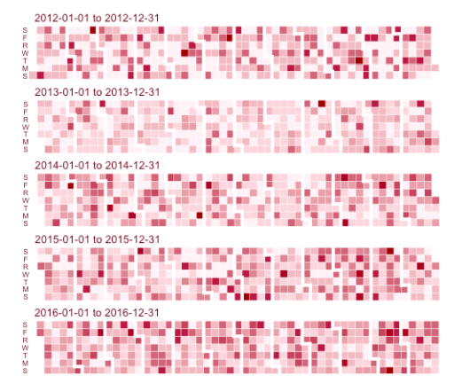

>Alluvial Time Series plot CT Drug Deaths
>Counts of Drugs Found in the Body at time of death
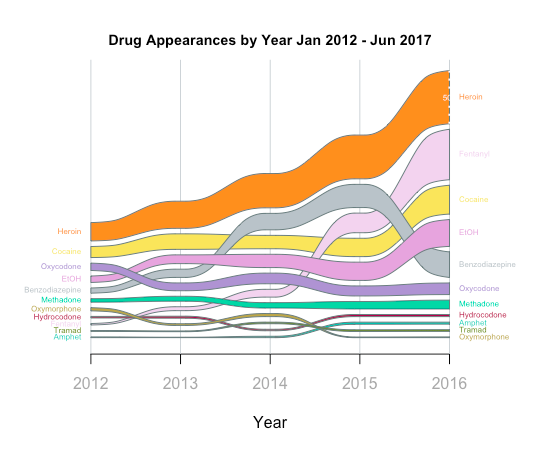

>Twitter Map using Google Maps Geolocation API
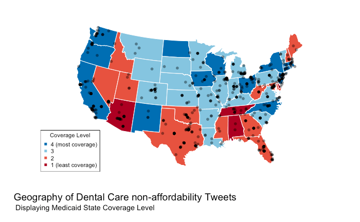

Last semester's term project with 4 predictive models:
>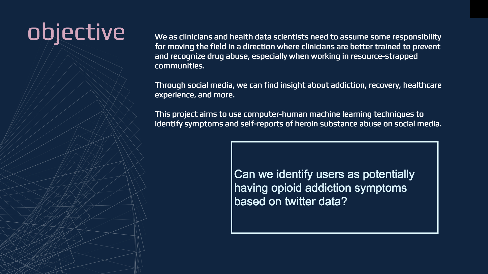 

### So What did I query?
As someone who provides HCV/HIV testing and needle exchange services,
I wanted to follow a specific guideline and used the DSM-5 criteria for opioid use disorder:

>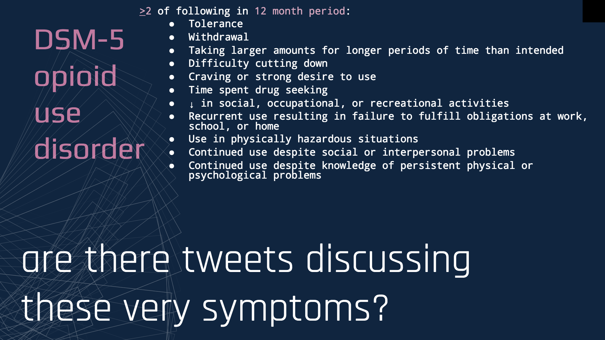 
>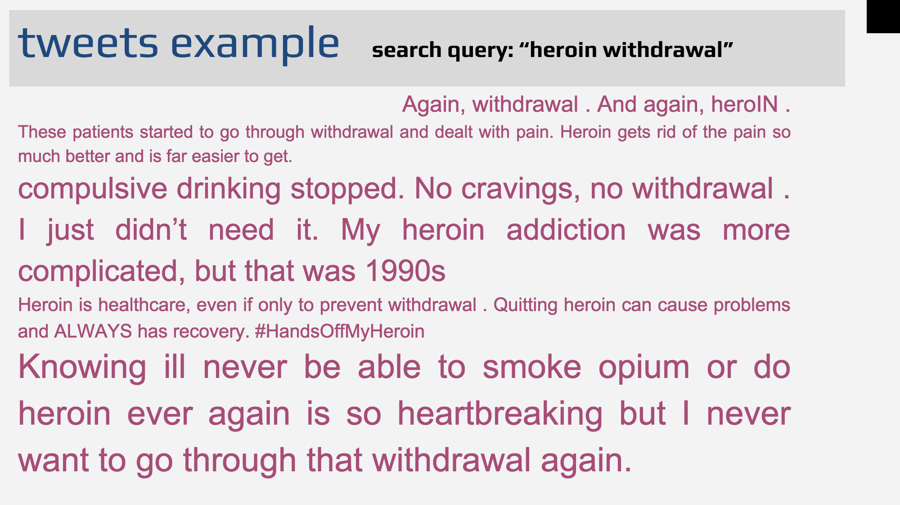

#### SIDE PROJECTS:
team members: _Isabel Metzger, Ruud Erie, Jager Hartman, Roman Paolucci_
1. [Security Neural Nets: Detecting Worms and Bots]

team members: _Andy Quan, Isabel Metzger, Roman Paolucci_
1. [Adverse Drug Events and Medication Extraction in EHRs](https://github.com/izzykayu/ClinicalNERandRelationIdentifier)

team members: _Mark Grivainis, Isabel Metzger_
1. [Among the Sleep] (https://github.com/izzykayu/AmongtheSleep)
_Time series physionet data to identify non-apnea sleep disturbances_ 

team members: _Isabel Metzger, Akshay T, Anupama Santhosh, Ethan Wu_
1. [A Natural Language Interface for Electronic Health Records](https://github.com/izzykayu/NaturalLanguageInterface)
_We built a natural language interface with the MIMIC III database using a seq2seq model for translation of natural language to SQL query_

team members: _Isabel Metzger, Julia Mahler, Teny Joseph, Nam Nguyen_
1. [Patient Quality Health Innovation Challenge]
_Twitter sentiment including my favorite form of expression (emojis) and chatbot creation_

team members: _Isabel Metzger,MS, Lorel Burns, DDS, Ana Raghunath_
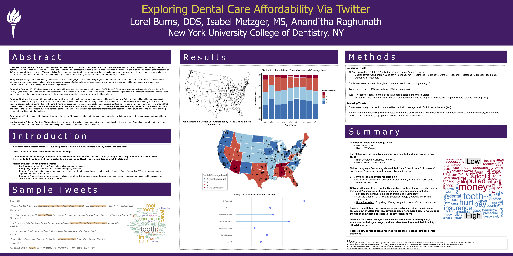
1. [Predicting tweeter’s state insurance coverage level via tweeter's profile text and tweet text](izzykayu.github.io/twitterdental.md)
2. [Exploring Dental Care Affordability via Twitter: A Descriptive Study](https://github.com/izzykayu/izzykayu.github.io/blob/master/DentalTweets/DentalCareAffordabilityViaTwitterPilot.pdf)

#### INDIVIDUAL PROJECTS:
1. [Identifying social media markers of substance abuse symptoms via tweets: Four predictive models](https://github.com/izzykayu/izzykayu.github.io/blob/master/herointweets/ML_4models_tweetanalysis_heroin_IzzyKayu.pdf)
2. [Supervised Learning predicting Heroin Death vs Non Heroin Death in CT Accidental Drug Related Deaths Government Dataset](https://github.com/izzykayu/izzykayu.github.io/blob/master/herointweets/DataStory_Short_IsabelMetzger_NYCDATAWEEK.pdf)

### PERSONAL PROJECTS:
1. DaniBot _(Chatbot based off my best friend Danielle because she is hilarious)_
2. Data Visualization of Tattoo Trends
3. Basketball Data Visualization #brooklynnets 

## Data Visualization and Exploratory Data Analysis
## REAL TALK: Opioids
Growing up in a working-class community where drugs offered comfort to many, I witnessed relatives and friends struggle with drug addiction, some until it killed them. By the time I turned 21, my uncle had died of Hepatitis C, contracted through needle sharing, and three of my friends had fatally overdosed on opiates. These losses forced me to confront the complexity of pharmacology at an early age—that drugs designed to maximize health often contribute to the undoing of vulnerable lives.

We as clinicians and health data scientists need to assume some responsibility for moving the field in a direction where clinicians are better trained to prevent and recognize drug abuse, and drug death, especially when working in resource-strapped communities. My community deserves this. **Every community deserves this.**

_This project uses multiple government open data sets_
1. **NATIONAL SNAPSHOT**: Glimpse of current US trends in opioid overdose death rates.
2. Machine Learning Prediction Model: heroin death vs accidental drug death with no heroin found in the body.
3. Additionally, I provide some analysis in trying to detect overprescribing of opioids.
### 1. NATIONAL SNAPSHOT
#### State Opioid Death Rates, adjusted for age and population.
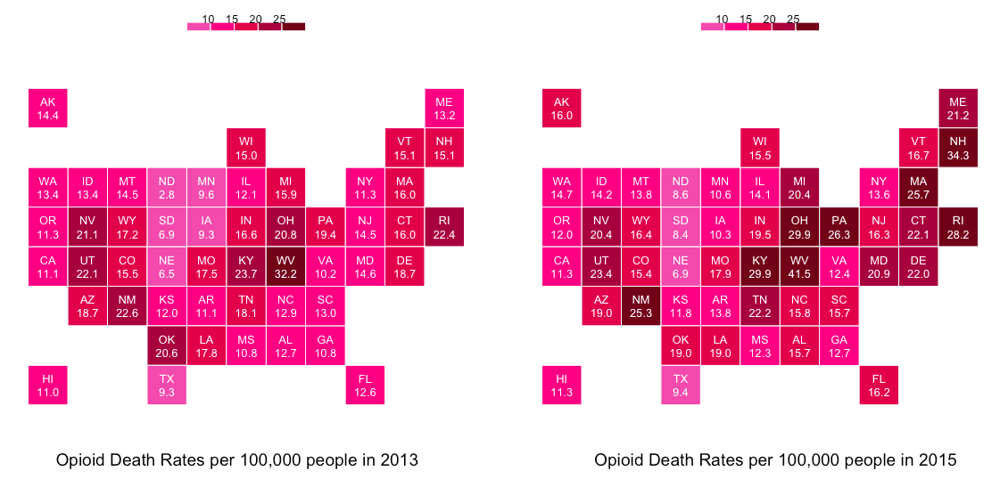
#### Change in Opioid Death Rates in States from 2013 - 2014. 
>When Opioid Deaths are adjusted for age and population, we can see that West Virginia currently has the highest rates of Opioid Overdose Deaths not only in the South, but for all states. In the Northeast, New Hampshire and Rhode Island have the highest Opioid Overdose Death Rates.
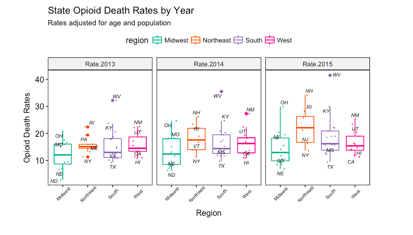

#### Opioid Death Rates by Year Compared with t-test p-values.
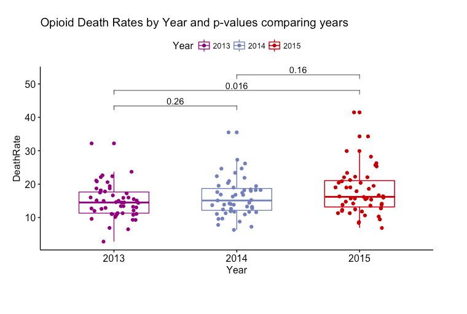
#### What states have significant Change in Opioid Death Rates? 
>Can we find novel ways in machine learning to save lives?
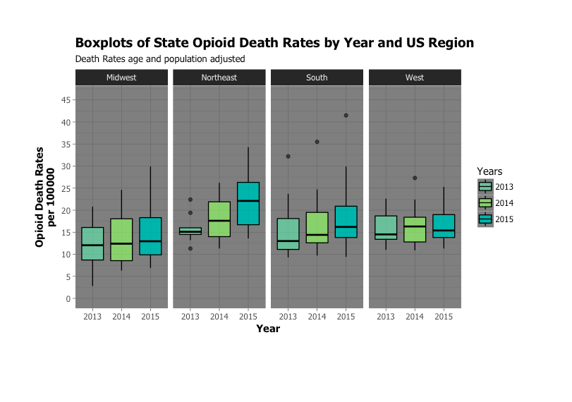
#### Summary Statistics on US Regions and Opioid Death Rates
>Summary statistics of Death Rates for US regions in 3 years
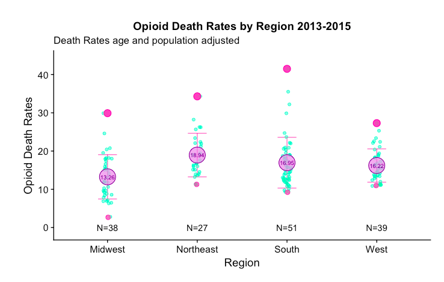

**How I prepared the data and made these plots** :bar_chart: 
[pdf format](https://github.com/izzykayu/izzykayu.github.io/blob/master/national/graphsglimpse.pdf),
[rmarkdown file](https://github.com/izzykayu/izzykayu.github.io/blob/master/national/graphsglimpse.Rmd)

#### The poster from the showcase at NYU Open Data Week '18 Event held by BUGS Open Source :heart:
>Data-storytelling.
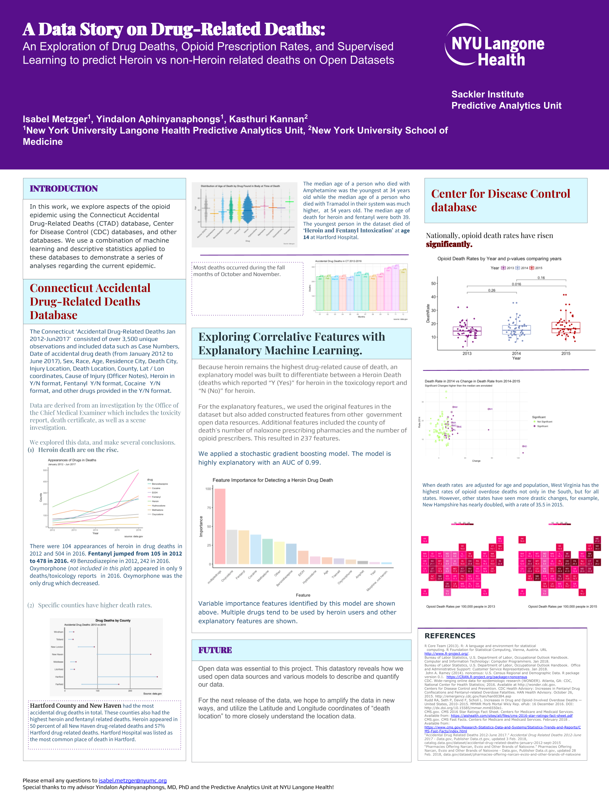

**Sources:**
[CDC Drug Overdose Dataset](https://www.cdc.gov/drugoverdose/data/statedeaths.html)
[CT Accidental Drug Deaths Dataset](https://catalog.data.gov/dataset/accidental-drug-related-deaths-january-2012-sept-2015)
