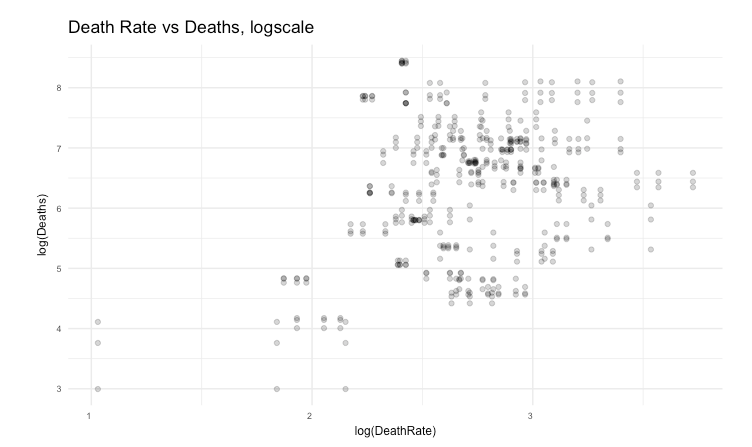

## NATIONAL OPIOID DEATHS EXPLORATORY DATA ANALYSIS
_Making graphs used in glimpse of US opioid deaths/ state rates - Exploratory Data Analaysis_
```{r, include=FALSE, message=FALSE, warning=FALSE}
library(readr)
X2015_death_data <- read_csv("2015-death-data.csv")
Xdeath_2013_2014 <- read_csv("drug_poisoning_deaths_by_state-_us_2013_2014-v7.csv")
mycols3 <- c("#c6d4e1", "#2f2016", "#fcfaea", "#456789")
library(tidyverse)
library(tidytext)
library(stringr)
library(DT)
death2015 <- X2015_death_data %>% dplyr::select(-X5, -X6, -X7, -X8)
colnames(death2015) <- c("state", "Range.2015", "Rate.2015", "Deaths.2015")
colnames(Xdeath_2013_2014) <- c("state", "Rate.2014", "Deaths.2014", "Range.2014",
                                "Rate.2013", "Deaths.2013", "Range.2013", "Change",
                                "Significant")

library(noncensus)
data("states")
overdosedeath <- death2015 %>% 
  left_join(states, by="state")
fullopioiddeathset_2013_2015 <- overdosedeath %>% 
  right_join(Xdeath_2013_2014)
library(ggthemes)
# re-order levels
reorder_size <- function(x) {
        factor(x, levels = names(sort(table(x), decreasing = TRUE)))
}
# creating new dataframe
longset <- fullopioiddeathset_2013_2015 %>% 
  gather(Deaths.2013,Deaths.2014,Deaths.2015, 
         key="Year", value="Deaths")
```
```{r plots of DeathRates}
theme_set(theme_classic())
cov.cols <-c("#9D1F2F","#d6604d", "#92c5de","#0571b0")
cols <-c('#520B44', '#C61859', '#EC8F02', '#F9D100')
longset$year <- longset$Year
longset$Year <- gsub("Deaths.2013", 2013, longset$Year)
longset$Year <- gsub("Deaths.2014", 2014, longset$Year)
longset$Year <- gsub("Deaths.2015", 2015, longset$Year)
 res <- longset %>% dplyr::select(Year, Deaths, region)
 res$region <- as.character(res$region)
 res$Year <- as.numeric(res$Year)
  colnames(res) <- c("Year", "Opioid.Deaths", "Region")

rate.13.15.plot <- longset %>% gather(Rate.2013,Rate.2014,Rate.2015, key="yr",
                                      value="Rate") %>% 
  mutate(name=reorder(name, Rate)) %>% ggplot(aes(name, Rate, fill=Year)) + geom_col() + 
  scale_fill_manual(values=c("#774F38", mycols3)) + 
  theme_classic() + coord_flip() + 
  labs(x="", y="Opioid Death Rate", subtitle="Age + Popln adjusted Death Rates") +
        # theme(axis.text.y = element_blank(), axis.ticks.y = element_blank(),
                theme(axis.text = element_text(hjust = 1, size=6.7, angle=20), 
                      axis.title = element_text(size=9), legend.position = "none") 

rawcounts.13.15.plot <- longset %>% mutate(name=reorder(name, Deaths))%>% 
  ggplot(aes(name, Deaths, fill=Year)) + geom_col() + 
  scale_fill_manual(values=c("#774F38", mycols3)) + 
  theme_classic() + coord_flip() + 
  labs(x="State", y="Opioid Deaths", subtitle="Opioid Death Counts") +
        theme(axis.text = element_text(hjust = 1, size=6.7, angle=20), 
              axis.title = element_text(size=9), legend.position = "none") 
#multiplot function
multiplot <- function(..., plotlist = NULL, file, cols = 1, layout = NULL) {
  require(grid)

  plots <- c(list(...), plotlist)

  numPlots = length(plots)

  if (is.null(layout)) {
    layout <- matrix(seq(1, cols * ceiling(numPlots/cols)),
                    ncol = cols, nrow = ceiling(numPlots/cols))
  }

  if (numPlots == 1) {
    print(plots[[1]])

  } else {
    grid.newpage()
    pushViewport(viewport(layout = grid.layout(nrow(layout), ncol(layout))))

    for (i in 1:numPlots) {
      matchidx <- as.data.frame(which(layout == i, arr.ind = TRUE))

      print(plots[[i]], vp = viewport(layout.pos.row = matchidx$row,
                                      layout.pos.col = matchidx$col))
    }
  }
}

multiplot(rawcounts.13.15.plot, rate.13.15.plot, cols=2)
```


```{r creating change plot 2013.2014}
Changeplot <- fullopioiddeathset_2013_2015 %>% 
  ggplot(aes(name, Change, fill=region)) + geom_col() + 
  labs(x="", y="Opioid Death Rate Change", 
       title="Percentage Change in Opioid Death Rates from 2013 to 2014") +
        theme(axis.text = element_text(hjust = 1, size=7, angle=90)) +
  scale_fill_manual(values=cols) + theme_hc()
 
 Changeplot 
 ```
  
  
```{r}
deathrate2013.plot <- fullopioiddeathset_2013_2015 %>% 
  ggplot(aes(state, Rate.2013, col=region))  + 
  geom_point(alpha=0.42,aes(size=Rate.2014)) + coord_flip() +
  labs(x="", y="Opioid Death Rate", 
       subtitle="Age and Population Adjusted 2013 Death Rates") +
        theme(axis.text = element_text(hjust = 1, size=6.7),
              axis.title = element_text(size=9), 
              legend.position = "none") + 
  scale_color_manual(values=cols)  +   # Draw points
  geom_segment(aes(x=state, 
                   xend=state, 
                   y=min(Rate.2013), 
                   yend=40), 
               linetype="dotted", col="black", 
               size=0.1) 

deathrate2014.plot <-fullopioiddeathset_2013_2015 %>% 
  ggplot(aes(state, Rate.2014, col=region)) + 
  geom_point(alpha=0.42, aes(size=Rate.2014)) + 
  labs(x="", y="Opioid Death Rate", 
       subtitle="Age and Population Adjusted 2014 Death Rates") +
        theme(axis.text = element_text(hjust = 1, size=6.7), 
              axis.title = element_text(size=9),
              legend.position = "none") + 
  coord_flip() + scale_color_manual(values=cols) + 
  geom_segment(aes(x=state, 
                   xend=state, 
                   y=min(Rate.2013), 
                   yend=40), 
               linetype="dotted", col="black", 
               size=0.1) 

multiplot(deathrate2013.plot, deathrate2014.plot, cols=2)
```


```{r plot of Rates }
op1 <- longset %>% gather(Rate.2013,Rate.2014,Rate.2015, key="yr", value="DeathRate") %>% 
  ggplot(aes(log(DeathRate), log(Deaths))) + geom_point(alpha=0.2) + 
  labs(subtitle="Death Rate vs Deaths, logscale") + theme_minimal() +
  theme(axis.text = element_text(hjust = 1, size=6.7), 
        axis.title = element_text(size=9))

op2 <- longset %>% gather(Rate.2013,Rate.2014,Rate.2015, key="yr", 
                          value="DeathRate") %>% 
  ggplot(aes(DeathRate, Deaths, col=Year,size=DeathRate)) + 
  geom_jitter(alpha=0.2) + 
  geom_point(alpha=0.6, pch=21) + 
  scale_color_manual(values=c('#69D2E7','#C7F464','#CC4E64')) + 
  labs(subtitle="Opioid Death Rate vs Opioid Deaths") + 
  theme(axis.text = element_text(hjust = 1, size=6.7), 
        axis.title = element_text(size=9))
op2
op1
```




```{r rates stategrid building}
rates1 <- longset %>% gather(Rate.2013,Rate.2014,Rate.2015, key="yr", value="Rate")
library(readr)
stategrid <- read.csv("state-grid-coordinates.tsv", stringsAsFactors = FALSE, sep="\t")
stategrid$ysideup <- 12 - stategrid$y
fullopioiddeathset_2013_2015$population <- 
  as.numeric(fullopioiddeathset_2013_2015$population)
```
```{r population vs deaths size by rates}
fullopioiddeathset_2013_2015 %>% ggplot(aes(population, Deaths.2015)) + 
  geom_point(aes(size=Rate.2015, col=region), alpha=0.5) + theme_classic() + 
  ggtitle("Death Counts vs Population in 2015")
```


```{r more data}
longset$popoverarea <- as.numeric(longset$population)/
  as.numeric(longset$area)
summary(100*(longset$popoverarea))
longset$highdense <- longset$popoverarea
longset$highdense <- 
  ifelse(longset$popoverarea > 230, "Dense","NotDense")
fullopioiddeathset_2013_2015$Change.2014.2015 <- 
  100*((fullopioiddeathset_2013_2015$Rate.2015/
          fullopioiddeathset_2013_2015$Rate.2014)-1)

table(fullopioiddeathset_2013_2015$Significant)

longset$population <- as.numeric(longset$population)
DF <- fullopioiddeathset_2013_2015 %>% 
  right_join(longset,by = c("state", "Range.2015", "Rate.2015", "name", 
                            "region", "division", "capital", "area", 
                            "population", "Rate.2014", "Range.2014",
                            "Rate.2013", "Range.2013", "Change", 
                            "Significant"))

interested.names <- c("Change.2014.2015","Significant","Change", "highdense",
                      "name", "region", "Deaths.2015", "Deaths.2015")
finalDF <- unique(DF[interested.names])
# sample( c(1:10) , 51 , replace=T)

fullopioiddeathset_2013_2015$Change.2014.2015 <- 
  100*((fullopioiddeathset_2013_2015$Rate.2015/fullopioiddeathset_2013_2015$Rate.2014)-1)
fullopioiddeathset_2013_2015$Change.2013.2014 <- 
  100*((fullopioiddeathset_2013_2015$Rate.2014/fullopioiddeathset_2013_2015$Rate.2013)-1)

dffff <- fullopioiddeathset_2013_2015 %>% gather(Change.2013.2014, Change.2014.2015, 
                                                 key="YearChange",
                                                 val="Percentage")

n <- 5
a<- rep(1:9, each=n)
b <- rep(2013:2014, each=51)
dffff$toadd<- c(a,a,1:9, 1, 2,3)
```
```{r showing percentage between years in deaths}
dffff$numbers <- paste(b, dffff$toadd)
dffff$numbers <- gsub(" ", ".", dffff$numbers)
dffff$numbers <- as.numeric(dffff$numbers)
DFDF <- dffff[c("numbers","Percentage")]

Deaths <- c(fullopioiddeathset_2013_2015$Deaths.2013, fullopioiddeathset_2013_2015$Deaths.2015)
DFDF %>% ggplot(aes(numbers, Percentage)) + 
  geom_point(aes(size=abs((dffff$Percentage -.0001)*2901),col=ifelse(Percentage > 0, 
                                                                     "grey", "maroon")),
             alpha=0.2) + geom_vline(xintercept = c(2013,2014, 2015), lty="dotted") + 
  geom_hline(yintercept = c(0), alpha=0.7) + geom_point(aes(size=abs((Percentage-.0001)*2999), 
                                                            col=ifelse(Percentage > 0, 
                                                                       "grey", "maroon")), 
                                                        pch=21, alpha=0.9) + 
  theme(legend.position = "none", axis.ticks.x = element_blank(), axis.text.x = element_blank()) + 
  labs(y= "% Change in Opioid Death Rate", 
       x="    2013-2014                                                2014-2015", 
       title="% Change in Opioid Death Rates ") + ylim(-70,150) 
```


```{r creating means for deathsranges plot, message=FALSE, warning=FALSE}

my_mean=aggregate(longset$Deaths, by=list(longset$region), mean) ; colnames(my_mean)=
  c("region" , "mean")
my_sd=aggregate(longset$Deaths, by=list(longset$region), sd) ; colnames(my_sd)=
  c("region" , "sd")
my_info=merge(my_mean, my_sd, by.x=1 , by.y=1)
deathsranges <- ggplot(longset) + 
        geom_point(aes(x = region, y = Deaths, size=Deaths), 
                   colour=rgb(0,1,0.60,0.34), alpha=0.2) + 
        geom_point(data = my_info, aes(x=region , y = mean), 
                   colour = rgb(0.7,0.6,0.9,0.7) , size = 8) +
        geom_errorbar(data = my_info, aes(x = region, y = sd, 
                                          ymin = mean - sd, ymax = mean + sd), 
                      colour = rgb(0.4,0.8,0.2,0.4) , width = 0.7 , size=1.5) + 
  ggtitle("Range of Opioid Deaths by US Demographic Region, 2013-2015") + theme_bw()
deathsranges
```


```{r opioid deaths different color scheme, message=FALSE, warning=FALSE}
df <- longset %>% dplyr::select(name, Year, region, Deaths)
unique(df) %>% ggplot(aes(x=reorder(name,Deaths),y=Deaths, fill=Year)) + 
  geom_col(col="white", alpha=0.8) + labs(title="Opioid Deaths 2013 - 2015", 
                                          x="State", y="Deaths") + 
  coord_flip() + theme_classic() +
        theme(axis.text = element_text(hjust = 1, size=7, angle=1)) + 
  scale_fill_manual(values=c("#ce1256", "#980043", "#67001f"))
```


```{r histogram of death rate in 2015}
hist(overdosegrid$Rate.2015, col="darkred")
```


```{r creating colors and map for Rate.2013}
overdosegrid$col <- sapply(overdosegrid$Rate.2013, function(x) {
      if (x < 10) {
        col <- "#df65b0"
    } else if (x < 15) {
        col <- "#e7298a"
    } else if (x < 20) {
        col <- "#ce1256"
    } else if (x < 25) {
        col <- "#980043"
    } else {
        col <- "#67001f"
    }
    return(col)
})
# 2013
par(mar=c(0,0,0,0), bg="white")
plot(0:1, 0:1, type="n", xlab="", ylab="", axes=FALSE, asp=1)
# Draw map like before.
par(new=TRUE, plt=c(0, 1, 0, 1))
symbols(overdosegrid$x, overdosegrid$ysideup,
        squares = rep(1, dim(overdosegrid)[1]),
        inches=FALSE,
        asp=1,
        bty="n",
        xaxt="n", yaxt="n",
        xlab="", ylab="",
        bg=overdosegrid$col,
        fg="#ffffff")
labeltext <- paste(overdosegrid$state, "\n", format(overdosegrid$Rate.2013, 2), sep="")
text(overdosegrid$x, overdosegrid$ysideup, labeltext, cex=.8, col="#ffffff")
mtext("Opioid Death Rates 2013", side = 2, line = -2.5, cex=1.9, outer = T, col="#27223C")
# Legend
par(new=TRUE, plt=c(0, 1, .9, 1))
plot(0, 0, type="n", xlim=c(0, 1), ylim=c(-.1,1), xlab="", ylab="", axes=FALSE)
rect(xleft = c(.4, .45, .5, .55, .6)-.025,
xright = c(.45, .5, .55, .6, .65)-.025,
ybottom = c(0,0,0,0,0)+.1, ytop=c(.2, .2, .2, .2, .2)+.1,
col=c("#df65b0", "#e7298a", "#ce1256", "#980043", "#67001f"),
border="#ffffff", lwd=1)
text(c(.45, .5, .55, .6)-.03, c(0,0,0,0)+.1, labels = 
       c("10", "15", "20", "25"), pos=3, cex=.8)
```
```{r map of 2015 opioid death rates}

#creating colors with death rates from 2015
overdosegrid$col <- sapply(overdosegrid$Rate.2015, function(x) {
      if (x < 10) {
        col <- "#df65b0"
    } else if (x < 15) {
        col <- "#e7298a"
    } else if (x < 20) {
        col <- "#ce1256"
    } else if (x < 25) {
        col <- "#980043"
    } else {
        col <- "#67001f"
    }
    return(col)
})

par(mar=c(0,0,0,0), bg="white")
plot(0:1, 0:1, type="n", xlab="", ylab="", axes=FALSE, asp=1)
# Draw map like before.
par(new=TRUE, plt=c(0, 1, 0, 1))
symbols(overdosegrid$x, overdosegrid$ysideup,
        squares = rep(1, dim(overdosegrid)[1]),
        inches=FALSE,
        asp=1,
        bty="n",
        xaxt="n", yaxt="n",
        xlab="", ylab="",
        bg=overdosegrid$col,
        fg="#ffffff")
labeltext <- paste(overdosegrid$state, "\n", format(overdosegrid$Rate.2015, 2), sep="")
text(overdosegrid$x, overdosegrid$ysideup, labeltext, cex=.8, col="#ffffff")
# Legend
par(new=TRUE, plt=c(0, 1, .9, 1))
plot(0, 0, type="n", xlim=c(0, 1), ylim=c(-.1,1), xlab="", ylab="", axes=FALSE)
rect(xleft = c(.4, .45, .5, .55, .6)-.025,
xright = c(.45, .5, .55, .6, .65)-.025,
ybottom = c(0,0,0,0,0)+.1, ytop=c(.2, .2, .2, .2, .2)+.1,
col=c("#df65b0", "#e7298a", "#ce1256", "#980043", "#67001f"),
border="#ffffff", lwd=1)
text(c(.45, .5, .55, .6)-.03, c(0,0,0,0)+.1, labels = c("10", "15", "20", "25"), pos=3, cex=.8)
mtext("Opioid Death Rates 2015", side = 2, line = -2.5, cex=1.9, outer = T, col="#27223C")
```


```{r dpi=300}
library(tidyverse)
alluv <- longset %>% dplyr::group_by(highdense, region, Significant) %>% tally()
library(alluvial)
cols <- c("#73c6b6", "#772877", "#7C821E", "#D8B98B", "#7A4012", 
          "#c6d4e1", "#2f2016", "#fcfaea", "#456789", "#F0B27A", "black")

colnames(alluv) <- c("AreaPopln", "USRegion", "Change.13.14", "n")
alluvial(alluv[1:3], freq=alluv$n, alpha=0.68, xw=0.2,cex.axis=0.8, 
         cex = 0.6, blocks=T, border="white",col = 
           ifelse(alluv$Change.13.14 == "Significant", "maroon", "grey"))
```


